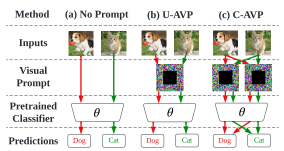
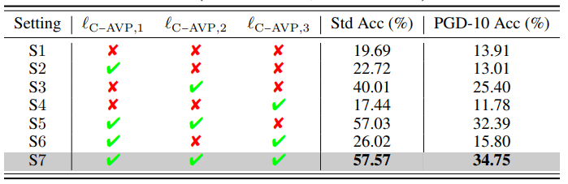

# Visual Prompting for Adversarial Robustness

This is the official code and belongs to this paper: [https://arxiv.org/abs/2210.06284](https://arxiv.org/abs/2210.06284)
For questions to the code, write an email to [chenaoch@msu.edu](mailto:chenaoch@msu.edu) or [peter.lorenz@itwm.fhg.de](mailto:peter.lorenz@itwm.fhg.de). Or even better open an issue on github so that everybody can see. 




Figure: Overview of C-AVP over two classes (red and green) vs. U-AVP and the prompt-free learning pipeline.


# Install 

`pip install -r requirements.txt`


# Usage


```
Code structure:
./
    attack/ # including all Fast-BAT & Auto Attack related attacks
    model/ # visual_prompt.py
    cfg.py # author style paths
    cifar10_pretrain.py # pretrain a CIFAR10 model
    gen_prompt.py # generate prompt
    evaluate_diff_pgd_steps.py # evaluate using different PGD steps
    losses.py # CW type loss
```

## Train ResNet18 on CIFAR10
`python cifar10_pretrain.py`

## Generate the Visual Prompt

Generate the class-wise prompt as proposed in the paper: 

`python gen_prompt.py --loss ce-cw --classwise`


## Evaluate on different attack strength
`python evaluate_diff_pgd_steps.py `


# Results



Figure: Sensitivity analysis of prompting regularizations in C-AVP on (CIFAR-10, ResNet18).


# Citation


```
@INPROCEEDINGS{10097245,
  author={Chen, Aochuan and Lorenz, Peter and Yao, Yuguang and Chen, Pin-Yu and Liu, Sijia},
  booktitle={ICASSP 2023 - 2023 IEEE International Conference on Acoustics, Speech and Signal Processing (ICASSP)}, 
  title={Visual Prompting for Adversarial Robustness}, 
  year={2023},
  volume={},
  number={},
  pages={1-5},
  doi={10.1109/ICASSP49357.2023.10097245}}
```
